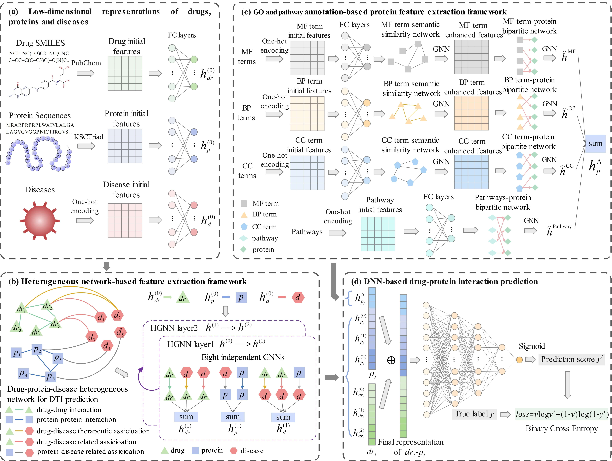

HNetPa-DTI:A drug-target interaction prediction framework based on drug-protein-disease heterogeneous network and gene ontology and pathway annotations
====

The environment of HNetGO-DTI
===
 python 3.8.8 
 cuda 10.2 - cudnn 7.6.5 
 pytorch 1.10.0 
 dgl 0.6.1 
 scikit-learn 0.22.1
 
Usage
===
 All data are csv files of binary relational data 
 Unzip the folders GO.rar 
 Run `HNetPa-DTI.py` 
 For neg3, neg5, neg7, neg9, neg3-bias, neg5-bias, neg7-bias and neg9-bias dataset, and two imbalanced datasets，run `HNetPa-DTI_Neg3579_and_neg3_5.py`. 
 Run `HNetPa-DTI_for_different_type_dataset.py` to perform HNetPa-DTI on different types of datasets（enzyme dataset, ion channel dataset, GPCR dataset, nuclear receptor dataset，and non-classified dataset）. 
 For different settings in the paper, run xxx.py file with a different name (`-Descriptor.py`，`-Hetro.py`，`-DDI&PPI.py`，`-Disease.py`，`-Pathway.py`，`-GO.py`，`-GOsim.py`). 
 For grid search for hyperparameters, run `GridSearchCV_for_standard_hyperparameters.py` to determine the values of four standard hyperparameters, run `GridSearchCV_for_GOsim_th.py`，`GridSearchCV_for_low-dimensional_dimensions`，and `GridSearchCV_for_n_hiddens_DNN.py` to determine extended hyperparameters. 
 Run `DNN.py` to perform DNN-o and DNN-d. 
 Run `HNetPa-DTI_10fold.py` to get the prediction scores of all drug-protein pairs.

Code and data
===
Raw data
------
（1）Drug-Target Interactions（DrugBank dataset/DTI_8207.csv）: the drug-target interactions were downloaded from the DrugBank database (https://go.drugbank.com/releases/latest). 
（2）Drug-Drug Interactions（network/Drugbank_DDI_574616）: the drug-drug interactions were downloaded from the DrugBank database (https://go.drugbank.com/releases/latest). 
（3）Protein-Protein Interactions（network/Uniprot_PPI_164797）: the protein-protein interactions were downloaded from the STRING database (https://cn.string-db.org/cgi/download?sessionId=bq0JfjmKDFZ5). 
（4）Drug-Disease Associations（network/Dr_D_m_39187.csv and Dr_D_t_21908.csv）: the drug-disease related associations and drug-disease therapeutic associations were downloaded from the CTD database (https://ctdbase.com/downloads/;jsessionid=037CE87EB76C543AB26A7DA404D4631D). 
（5）Protein-Disease Associations（network/P_D_m_29201.csv and P_D_t_1933.csv）: the protein-disease related associations and protein-disease therapeutic associations were downloaded from the CTD database (https://ctdbase.com/downloads/;jsessionid=037CE87EB76C543AB26A7DA404D4631D). 
（6）Protein-GO term Associations（GO/GO_uniprot/GO_MF_9071.csv，GO_BP_18737.csv，GO_CC_9990.csv）：the protein-GO term associations were downloaded from QuickGO browser（https://www.ebi.ac.uk/QuickGO/）. 
（7）Protein-Pathway Associations（Pathway/uniprot_pathways_25161.csv and all_pathway_id_2392.csv）：the protein-Pathway associations were downloaded from the KEGG Mapper（https://www.genome.jp/kegg/mapper/）, the Reactome database（https://reactome.org/download-data），and the Wikipathways dataset（Python package pywikipathways）. 
（8）Extra Drug-Target Interactions（case studies/KEGG/DTI_3920.csv and case studies/CHEMBL/DTI_6982.csv）：the extra drug-target interactions were downloaded from the KEGG BRITE database（https://www.kegg.jp/brite/br08906） and the ChEMBL database（https://chembl.gitbook.io/chembl-interface-documentation/downloads）.

Construction of datasets
------
 First, the DrugBank dataset folder contains the files DTI_8207.csv, Drug_1520.csv, Protein_1771.csv.
 
### The detailed steps for the construction of the DTI-net dataset are as follows:
Under the DrugBank dataset folder 
（1）run `Get_max_subG.py` to divide the DTIs into two parts (DTI-benchmark and DTI-extra). 
（2）run `Get_shortest_length.py` to get l_b of all drug-protein pairs (Dr_P_shortest_length.csv). 
（3）run `Get_N3_N5_N7_N9.R` to classify unlabeled drug-protein pairs into N3-N9 according to l_b (negative samples/DTI benchmark N3_5_7_9). 
Under the HNGO-DTI folder 
（4）Run `Get_l_h_heterogeneous.py` to get l_h of all drug-protein pairs in HNet-DrPD (Dr_D_P_shortest_length.csv). 
Under the DrugBank dataset folder 
（5）run `Get_need_neg.R` to select candidate negative samples based on l_h>=3 (negative samples/my_need_neg3, my_need_neg5.csv and extra_neg3.csv). 
（6）run `select_negative_by_network.R` to get neg_DTI-net_8020.csv and neg_DTI-net_187.csv. 

### The detailed steps for the construction of the DTI-rand dataset are as follows:
 Under the DrugBank dataset folder，run `select_negative_randomly.R` to randomly select negative samples (neg_DTI-rand_8020.csv and neg_DTI-rand_187.csv). 
         
### Divide the testing set according to different prediction tasks (SR, SD, SP, and SDP)：
Under the DrugBank dataset folder 
（1）run `train_test_splict_DTI-rand.R` to divide the testing set (SR, SD, SP, SDP) of DTI-rand dataset.  
（2）run `train_test_splict_DTI-net.R` to divide the testing set (SR, SD, SP, SDP) of DTI-net dataset.  

### The process of dividing the training/validation/testing set is as follows：
Under the DrugBank dataset folder，run `train_valid_test_dataset.py` to divide the dataset into training/validation/testing set.

Analysis of shortest path lengths in the heterogeneous network
------
Under the case studies folder，run `analysis_shortest_path_length.R` to view l_h of the DTIs of KEGG database and ChEMBL database.

Negative samples from N3-N9 (i.e., neg3-neg9, and neg3-b-neg9-b in the paper)
------
Under the DrugBank dataset folder 
（1）Run `select_negative_from_N3_5_7_9_randomly.R` to get negative samples from N3-N9. 
（2）Run `select_negative_with_bias_from_N3_5_7_9_randomly.R` to get negative samples with hidden bias1 from N3-N9. 
（3）Run `train_valid_test_dataset_neg3_5_7_9.py` to divide the datasets into training/validation/testing set.

Different types of datasets (i.e., enzyme dataset, ion channel dataset, GPCR dataset, nuclear receptor dataset，and non-classified dataset in the paper)
------
Under the differnet types of datasets folder 
（1）Run `negative_net.R` to get negative samples for different datasets. 
（2）Run `train_valid_test_dataset_different.py` to divide the datasets into training/validation/testing set.

Calculation of feature
------
### Calculation of GO term similarities
Run `cal_GO_sim.R` to calculate GO similarity values. (GO/GO_sim/)

### Calculation of molecular fingerprint and protein descriptor
（1）Run `cal_fingerprint.R` to calculate the PubChem fingerprint.(feature/) 
（2）Run `trans_to_fasta.R` to convert protein_seq_13816.csv to protein_13816.fasta, and then use the iLearnPlus to calculate the KSCTriad.(feature/)

Analysis of prediction scores of the DTIs from other databases
------
Under the case studies folder 
（1）Run `case studies.R` to view prediction scores of training sets and predict other scores.（Predict_scores.csv） 
（2）Run `analysis_scores.R` to view the prediction scores of the DTIs of KEGG database and ChEMBL database.
